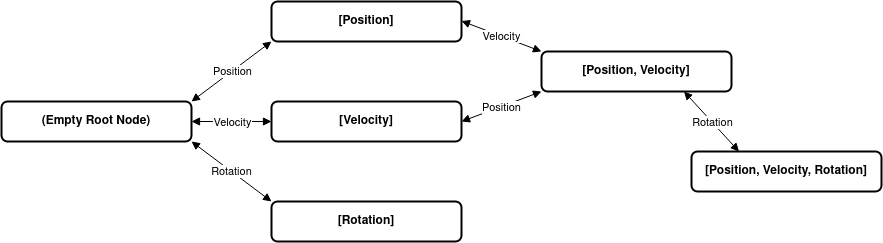
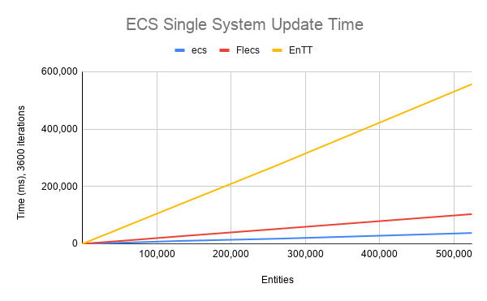

# ECS

A small archetype based entity component system. I wrote this out of my own
curiosity. This is not meant to be used in a "real" project.

## Usage

Copy `ecs.c` and `ecs.h` to your project.

```c
#include "ecs.h"
#include <stdio.h>

struct Position {
  float x;
  float y;
};

struct Velocity {
  float x;
  float y;
};

void Move(ecs_view_t view, unsigned int row) {
  Position *p = ecs_view(view, row, 0);
  Velocity *v = ecs_view(view, row, 1);
  p->x += v->x;
  p->y += v->y;
  printf("Entity moved to (%f, %f)\n", p->x, p->y);
}

int main(int argc, char *argv[]) {
  ecs_registry_t *registry = ecs_init();

  const ecs_entity_t pos_component = ECS_COMPONENT(registry, Position);
  const ecs_entity_t vel_component = ECS_COMPONENT(registry, Velocity);

  for (int i = 0; i < 10; i++) {
    ecs_entity_t e = ecs_entity(registry);
    ecs_attach(registry, e, pos_component);
    ecs_attach(registry, e, vel_component);
    ecs_set(registry, e, pos_component, &(Position){0.0f, 0.0f});
    ecs_set(registry, e, vel_component, &(Velocity){1.0f, 1.0f});
  }

  ECS_SYSTEM(registry, Move, 2, pos_component, vel_component);

  while (true) {
    ecs_step(registry);
  }

  ecs_destroy(registry);

  return 0;
}
```

## How it works

Entity component systems lets you address performance and maintenance problems
that typically arise in traditional object-oriented programming (OOP). Heavily
nested hierarchies seen in OOP causes memory to be distributed all over the
heap, forcing the CPU to twiddle its thumbs as it waits for data to be fetched
from main memory. Object oriented inheritance hierarchies are also difficult to
change as a project gets bigger and bigger.

Entities are simply represented as 64 bit integers. They are stored in an
archetype, a table where entity component data can be accessed.

Components are just POD (Plain old data). They can be structs, or even integers.
You can attach components to an entity. If you used Unity before, this kind of
architecture may seem familiar to you.

Systems are pieces of code that updates a given set of components. For example,
a system that runs on `Position` and `Velocity` components will update all
entities with at least those two components.

Archetypes are a huge part of making this entity component system work as fast
as it can. Each archetype stores a unique set of component types and component
data. Archetypes are also vertices in a graph, with left and right edges.
Traversing left in the graph leads to archetypes with one less component type,
while traversing right finds archetypes with one additional component type.



Storing archetypes in a graph is a fast approch to search for an archetype.
Sander Mertens, the author of [Flecs](https://github.com/SanderMertens/flecs),
explains this in depth in his [blog
post](https://ajmmertens.medium.com/building-an-ecs-2-archetypes-and-vectorization-fe21690805f9).

#### More Details

- [Entities, components and systems](https://medium.com/ingeniouslysimple/entities-components-and-systems-89c31464240d)
- [Building an ECS #2: Archetypes and Vectorization](https://ajmmertens.medium.com/building-an-ecs-2-archetypes-and-vectorization-fe21690805f9)

## Benchmarks

The graph below shows the time it takes to update a given number of entities,
3600 times. Every entity has two components, and as a result, a single system is
performing the operations.

I benchmarked the ECS in this repository,
[Flecs](https://github.com/SanderMertens/flecs), and
[EnTT](https://github.com/skypjack/entt).



| Entities | ecs       | Flecs      | EnTT       |
|----------|-----------|------------|------------|
| 1        | 01 ms     | 22 ms      | 07 ms      |
| 2        | 01 ms     | 13 ms      | 09 ms      |
| 4        | 01 ms     | 34 ms      | 09 ms      |
| 8        | 01 ms     | 27 ms      | 25 ms      |
| 16       | 02 ms     | 35 ms      | 46 ms      |
| 32       | 03 ms     | 45 ms      | 84 ms      |
| 64       | 06 ms     | 56 ms      | 101 ms     |
| 128      | 09 ms     | 75 ms      | 134 ms     |
| 256      | 17 ms     | 118 ms     | 284 ms     |
| 512      | 34 ms     | 173 ms     | 561 ms     |
| 1,024    | 71 ms     | 210 ms     | 1,124 ms   |
| 2,048    | 133 ms    | 438 ms     | 2,181 ms   |
| 4,096    | 296 ms    | 864 ms     | 4,289 ms   |
| 8,192    | 586 ms    | 1,633 ms   | 8,513 ms   |
| 16,384   | 1,152 ms  | 3,279 ms   | 17,194 ms  |
| 32,768   | 2,357 ms  | 6,427 ms   | 34,019 ms  |
| 65,536   | 4,691 ms  | 12,836 ms  | 68,607 ms  |
| 131,072  | 9,990 ms  | 26,230 ms  | 137,298 ms |
| 262,144  | 17,728 ms | 51,824 ms  | 273,707 ms |
| 524,288  | 37,713 ms | 103,477 ms | 556,364 ms |

I couldn't get to benchmark over 1 million entities as EnTT crashed with the
following message:

```
entt.hpp:8033: entt::basic_registry< <template-parameter-1-1> >::entity_type entt::basic_registry< <template-parameter-1-1> >::create() [with Entity = entt::entity; entt::basic_registry< <template-parameter-1-1> >::entity_type = entt::entity]: Assertion `to_integral(entt) < traits_type::entity_mask' failed.
```
